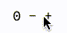

# Next x Tailwind x Framer Boilerplate
Common patterns I use when building Next.js applications, bundled into a template to save myself some time ⚙️

## App-wide state
By default, [the application](pages/_app.tsx) is wrapped with a Context Provider, defined at [hooks/useAppState.tsx](hooks/useAppState.tsx). The default store data that is currently loaded exists solely to handle modals. If you wish to add to the data, update the `AppState` type in [types/app.ts](types/app.ts), then update the `DEFAULT_APP_STATE` constant at the top of [hooks/useAppState.tsx](hooks/useAppState.tsx). To access the data, you can use the `useAppState` hook, which is similar to the `useState` hook, except that it accepts deep partial updates to the store instead of needing to be called with an exact copy of the data structure.

## Example of extending app-wide data
First we update the typings and the default state:
```tsx
// types/app.ts
export type AppState = {
  modal: null | Modal
  count: number // add the new type
}

...

// hooks/useAppState.ts
const DEFAULT_APP_STATE: AppState = {
  modal: null,
  count: 0, // set the default value
}
```

Then we can use our new slice of state however we like using the [useAppState](hooks/useAppState.tsx) hook:
```tsx
import { useAppState } from 'hooks'

function useCounter() {
  const [state, update] = useAppState()
  return [
    state.count,
    {
      increment: () => update({ count: state.count + 1 }),
      decrement: () => update({ count: state.count - 1 }),
    },
  ]
}

export function Counter() {
  const [count, { increment, decrement }] = useCounter()

  return (
    <div className="flex gap-x-2">
      <p>{count}</p>
      <button onClick={decrement}>-</button>
      <button onClick={increment}>+</button>
    </div>
  )
}
```


## Modals

The only app-wide store data that exists by default is to support a simple alert system built on top of [@reach/dialog](https://reach.tech/dialog/). There are two example alerts already baked in to follow along, but a rough overview of how to create and add/use alerts goes as follows:

1. Create a new component for your alert to use
2. Export the component from `components/modals.tsx` *as a named export*
3. Import and use the `useModal` hook as desired

```tsx

export function Notification({ text }: { text: string }) {
  const { close } = useModal()

  return (
    <motion.div
      className={classNames(
        'bg-white rounded-sm border border-blue-200 py-5 px-7 m-10',
        'relative flex flex-col justify-between items-start',
        'filter drop-shadow'
      )}
      initial={{ opacity: 0, x: -300, y: 0 }}
      exit={{ opacity: 0, x: -300, y: 0 }}
      animate={{ opacity: 1, x: 0, y: 0 }}
    >
      <p>{text}</p>
      <button
        className="transition-colors absolute -top-2 -right-2 rounded-full bg-blue-200 text-white w-7 h-7 hover:bg-blue-600"
        onClick={close}
      >
        X
      </button>
    </motion.div>
  )
}
```

```ts
import { useModal } from 'hooks'

const modal = useModal()

const openNotification = () =>
  modal.open({
    name: 'Notification',
    label: 'A notification',
    props: { text: "Here's an example of a notification modal" },
    position: ['start', 'end'],
  })
```
If you look at [types/app.ts](types/app.ts), the `Modal` type is based off of the named exports imported from `components/modals`. Whatever functional component you wish to use as an alert should be exported from this file so the typings for the methods returned by `useModal` will update automatically.

## Collapsible Content

The [Collapsible](components/Collapsible.tsx) component can be used to create components with collapsible/expandable content. It is built on top of [@reach/dialog](https://reach.tech/dialog/). You have the choice between controlling the open/close state yourself in a parent component, or letting it control its own state. To control the state of the Collapsible yourself, you must supply it with two props: a boolean value, `open`, and a callback, `onChange`.

```tsx
// Collapsible in charge of its own state
function Collapsible1() {
  return (
    <Collapsible title={isOpen => <p>{isOpen ? 'close' : 'open'}</p>}>
      🤖
    </Collapsible>
  )
}

// Collapsible that is having its state controlled externally
function Collapsible2() {
  const [isOpen, setIsOpen] = useState(false)

  return (
    <Collapsible
      open={isOpen}
      onChange={() => setIsOpen(!isOpen)}
      title="click to toggle"
    >
      👻
    </Collapsible>
  )
}

```